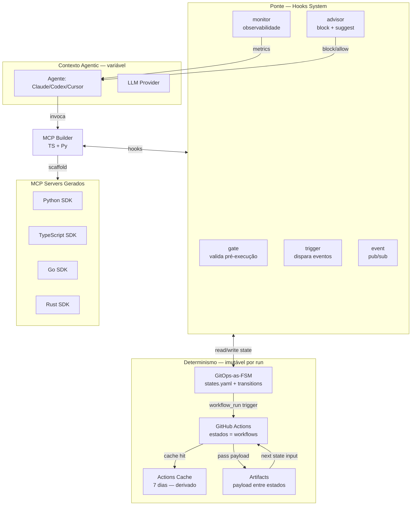
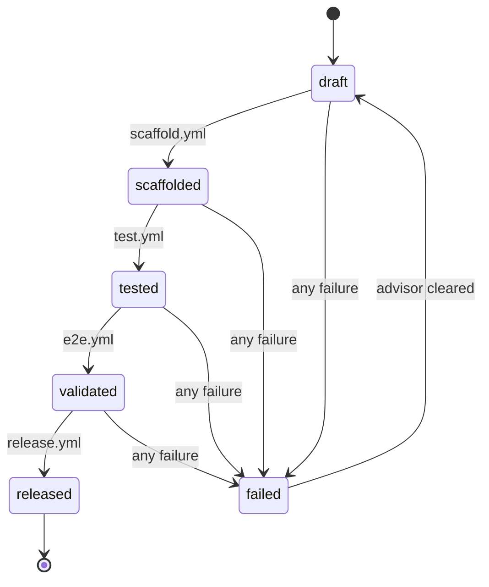
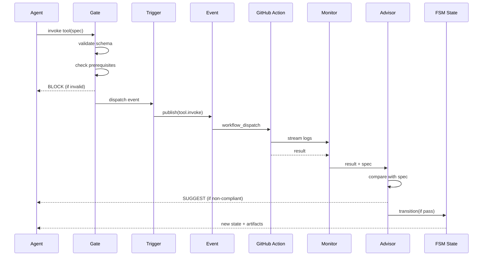
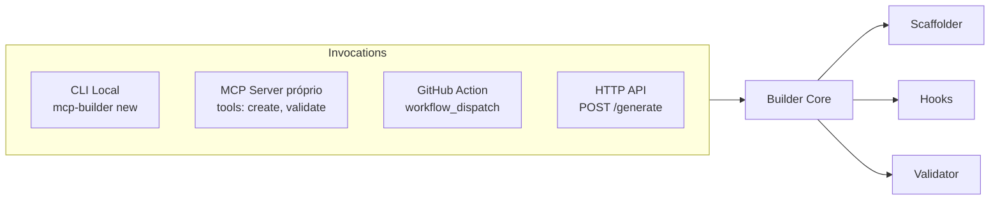
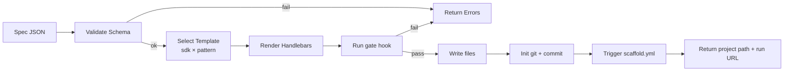
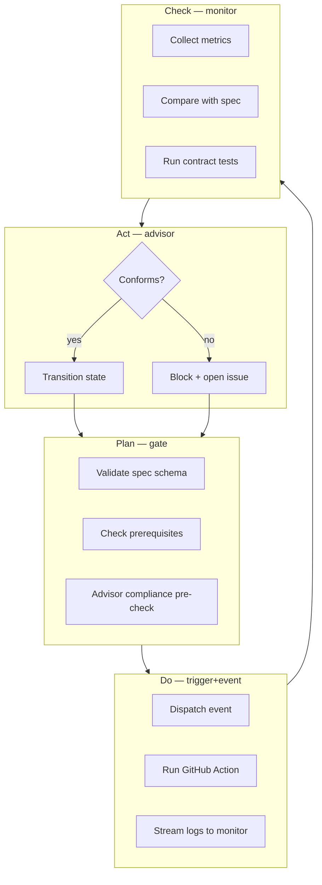

# MCP Builder — Blueprint Arquitetural

> **Versão**: 1.0.0 • **Status**: Aprovado • **Padrão**: Ouro • **Última revisão**: 2026-07-07

Um sistema modular para **gerar, validar e operar MCP servers** combinando
**contexto agentic** (LLM + tools + hooks) com **determinismo de workflow**
(GitHub Actions + GitOps-as-FSM). O Builder é ele próprio um plugin CLI que
pode ser carregado por agentes como Claude Code, Codex CLI, Cursor, etc.

---

## 1. Contexto e Motivação

### 1.1 O problema

MCP servers atuais sofrem de três antipadrões recorrentes:

1. **Estado fantasma**: lógica de estado dispersa entre prompts, ferramentas e
   memória volátil do LLM — sem auditoria, sem replay, sem rollback.
2. **Determinismo fraco**: workflows de CI/CD tratam o agente como black box;
   não há FSM formal nem Gatilho-evento-resposta verificável.
3. **Templates ad hoc**: cada novo MCP começa do zero; padrões (event, factory,
   stateless) não são codificados — coesão e coerência ficam ao acaso.

### 1.2 A tese

> **Tese**: Um MCP server é, fundamentalmente, uma **máquina de estados
> determinística** exposta ao LLM. O LLM é o *contexto* (input variável,
> heurística, criatividade); o workflow GitHub Actions é o *determinismo*
> (transições válidas, validações, auditoria). O **hooks system** é a
> **ponte** que mantém coerência entre os dois mundos.

### 1.3 Princípios (PDCA em loop)

| Princípio | Onde se materializa |
|---|---|
| **Plan** — planejar antes de executar | `gate` hook (advisor pré-execução) |
| **Do** — executar conforme padrão | `trigger` + `event` hooks (dispatch por evento) |
| **Check** — validar retorno | `monitor` hook (observabilidade + contract tests) |
| **Act** — corrigir/bloquear não-conforme | `advisor` hook (block + suggest) |

Cada ciclo PDCA é uma transição de FSM materializada como GitHub Action run.
O `git log` é o **event sourcing** — fonte única de verdade auditável.

---

## 2. Visão Geral da Arquitetura



### 2.1 Camadas

| Camada | Responsabilidade | Tecnologia |
|---|---|---|
| **L1 — Plugin CLI** | Interface com agente (Claude/Codex/etc) | TS + commander, MCP SDK próprio |
| **L2 — Hooks System** | gate/trigger/event/monitor/advisor | TS + fastify (event bus) |
| **L3 — Scaffolder** | Gera projeto a partir de template + spec | TS + handlebars + json-schema |
| **L4 — GitOps FSM** | Estado versionado + transições | YAML in repo + Actions workflows |
| **L5 — Templates** | 4 SDKs × 3 padrões (event/factory/stateless) | Py/TS/Go/Rust |
| **L6 — Tests** | 5 camadas (unit/contract/e2e/property/mutation) | vitest+pytest+stryker+hypothesis |

---

## 3. GitOps como Máquina de Estados Finita (FSM)

### 3.1 Modelo formal

O projeto é modelado como uma FSM **(S, Σ, δ, s₀, F)** onde:

- **S** = conjunto de estados (versionado em `.mcp/state/states.yaml`)
- **Σ** = alfabeto de eventos (labels de Actions, tags git, issue comments)
- **δ** = função de transição (declarada em `transitions.yaml`)
- **s₀** = estado inicial (`draft`)
- **F** = estados finais (`released`, `archived`)

### 3.2 Estados padrão

```yaml
# .mcp/state/states.yaml
states:
  draft:
    description: "Spec escrita, código ainda não gerado"
    on_enter: [gate.validate_spec, advisor.check_compliance]
  scaffolded:
    description: "Builder gerou código a partir do template"
    on_enter: [gate.validate_structure, monitor.collect_metrics]
  tested:
    description: "Todos os 5 níveis de teste passaram"
    on_enter: [gate.validate_tests, advisor.check_coverage]
  validated:
    description: "E2E via Actions executou com sucesso"
    on_enter: [monitor.validate_determinism, advisor.sign_off]
  released:
    description: "Tag git criada, artifact publicado"
    on_enter: [trigger.publish_artifact, monitor.notify]
    terminal: true
  failed:
    description: "Advisor bloqueou — aguarda correção"
    on_enter: [advisor.collect_failure, trigger.open_issue]
  archived:
    description: "Deprecado, sem novas transições"
    terminal: true
```

### 3.3 Transições

```yaml
# .mcp/state/transitions.yaml
transitions:
  - from: draft
    to: scaffolded
    event: scaffold.complete
    action_workflow: scaffold.yml
  - from: scaffolded
    to: tested
    event: scaffold.validated
    action_workflow: test.yml
  - from: tested
    to: validated
    event: tests.passed
    action_workflow: e2e.yml
  - from: validated
    to: released
    event: e2e.passed
    action_workflow: release.yml
  - from: "*"
    to: failed
    event: "*.failed"
    action_workflow: advisor-block.yml
  - from: failed
    to: draft
    event: advisor.cleared
    action_workflow: reset.yml
```

### 3.4 Materialização em GitHub Actions

Cada **estado** = um **workflow file**. Cada **transição** = um
`workflow_run` trigger que dispara o próximo workflow.



**Artifact passing**: o output de cada workflow é serializado em JSON e enviado
como artifact (`actions/upload-artifact`). O workflow seguinte baixa
(`actions/download-artifact`) e injeta como input. Isto garante
**determinismo**: cada estado consome exatamente o output do anterior,
sem variáveis de ambiente não-reprodutíveis.

---

## 4. Sistema de Hooks (Ponte Agentic ↔ Determinístico)

### 4.1 Os 5 hooks fundamentais

| Hook | Quando roda | O que faz | Falha? |
|---|---|---|---|
| **gate** | Antes de qualquer execução | Valida spec, schema, permissões, pré-condições | Sim → bloqueia |
| **trigger** | Após gate passar | Dispara evento no bus, agenda Actions | Sim → aborta execução |
| **event** | Quando evento chega | Roteia para handler correto (pub/sub) | Não — apenas roteia |
| **monitor** | Durante + após execução | Coleta métricas, logs, traces | Não — observabilidade |
| **advisor** | Após execução | Compara resultado com spec; bloqueia se não-conforme; sugere correção | Sim → marca `failed` |

### 4.2 Sequência de execução



### 4.3 Contrato de Hook (TypeScript)

```typescript
// hooks/types.ts
export interface HookContext {
  spec: MCPSpec;              // o que foi pedido
  state: FSMState;            // estado atual
  artifacts: Artifact[];      // outputs anteriores
  env: Record<string, string>;
  git: { ref: string; sha: string; repo: string };
}

export interface HookResult {
  ok: boolean;
  block?: { reason: string; suggestions: string[] };
  metrics?: Record<string, number>;
  artifacts?: Artifact[];
}

export type Hook<T = unknown> = (ctx: HookContext, payload: T) => Promise<HookResult>;
```

### 4.4 Registry e plugins

Cada hook é um **plugin** que se registra no `HookRegistry`. O agente carrega
apenas os plugins necessários (ex: Claude Code pode carregar `gate` + `advisor`
e pular `monitor` em modo silencioso).

```typescript
// hooks/registry.ts
export class HookRegistry {
  private gates: Map<string, Hook> = new Map();
  private triggers: Map<string, Hook> = new Map();
  private advisors: Map<string, Hook> = new Map();

  register(category: 'gate'|'trigger'|'event'|'monitor'|'advisor',
           name: string, fn: Hook) {
    // ...
  }

  async run(category: string, name: string, ctx: HookContext, payload?: unknown)
    : Promise<HookResult> {
    // ...
  }
}
```

---

## 5. Padrões de Design (Templates)

Cada template combina **linguagem** (Python/TS/Go/Rust) × **padrão**
(event/factory/stateless). Três padrões cobrem 95% dos casos de MCP server.

### 5.1 Event-Driven Pattern

**Quando**: MCP reage a eventos externos (webhook, schedule, file change).
**Estrutura**:
```
mcp-server/
  src/
    events/         # handlers por tipo de evento
    handlers/       # business logic
    state/          # projeções (read models)
  .mcp/state/       # FSM específico
```

### 5.2 Factory Pattern

**Quando**: MCP cria objetos tipados a partir de input do LLM (ex: criar
`Database`, `Queue`, `Pipeline`).
**Estrutura**:
```
mcp-server/
  src/
    factories/      # uma factory por tipo de objeto
    validators/     # schema por tipo
    registry/       # registro de factories conhecidas
```

### 5.3 Stateless Execution Pattern

**Quando**: MCP executa ação, retorna resultado, não mantém estado. Mais comum.
**Estrutura**:
```
mcp-server/
  src/
    tools/          # uma tool = um arquivo
    schemas/        # input/output JSON Schema
    handlers/       # implementação
```

### 5.4 Matriz de templates

| SDK \ Padrão | Event | Factory | Stateless |
|---|---|---|---|
| Python (FastMCP) | ✅ | ✅ | ✅ |
| TypeScript (@mcp/sdk) | ✅ | ✅ | ✅ |
| Go (mcp-go) | ✅ | ✅ | ✅ |
| Rust (rmcp) | ✅ | ✅ | ✅ |

12 templates no total. Cada template já vem com:
- `.mcp/state/states.yaml` (FSM próprio)
- `.github/workflows/` (build, test, release)
- `tests/` (unit + contract + property)
- `README.md` + `docs/adr/`
- `mcp.json` (configuração do server para Claude Desktop / Cursor)

---

## 6. MCP Builder — O Gerador

### 6.1 Modos de invocação (4)



#### 6.1.1 CLI Local
```bash
npx mcp-builder new my-server \
  --sdk python \
  --pattern event \
  --name "My MCP" \
  --tools "create_user,delete_user"
```

#### 6.1.2 MCP Server próprio
O Builder se expõe como MCP server. Agentes como Claude Code podem chamar
suas tools:

```json
{
  "mcpServers": {
    "mcp-builder": {
      "command": "npx",
      "args": ["mcp-builder", "serve"]
    }
  }
}
```

Tools expostas: `create_project`, `add_tool`, `add_hook`, `run_tests`,
`validate_spec`, `transition_state`.

#### 6.1.3 GitHub Action
```yaml
- uses: mcp-builder/action@v1
  with:
    name: my-server
    sdk: python
    pattern: event
```

#### 6.1.4 HTTP API
```bash
curl -X POST https://builder.mcp.dev/generate \
  -H "Content-Type: application/json" \
  -d '{"name":"my-server","sdk":"python","pattern":"event"}'
```

### 6.2 Pipeline de geração



---

## 7. Estratégia de Testes (5 Camadas)

| Camada | Ferramenta | O que valida | Quando roda |
|---|---|---|---|
| **Unit** | vitest (TS) + pytest (Py) | Funções puras do builder e hooks | Cada commit |
| **Contract** | JSON Schema + pact | Shape das tools MCP entre builder e runtime | PR merge |
| **E2E via Actions** | matrix strategy | Instancia MCP do zero, roda tools, valida retorno | PR + cron diário |
| **Property-based** | fast-check (TS) + hypothesis (Py) | Invariantes do FSM e do scaffolder | Nightly |
| **Mutation** | stryker (TS) + mutmut (Py) | Qualidade dos testes (não só coverage) | Release gate |

### 7.1 Invariantes validadas por property-based

```typescript
// Exemplo de invariantes do FSM
import fc from 'fast-check';

test('FSM nunca transita para estado terminal sem passar por released',
  () => fc.assert(fc.property(
    fc.array(transitionArb),
    (transitions) => {
      const fsm = new FSM(states, transitions);
      const trace = fsm.run();
      expect(trace).toSatisfy(trace =>
        trace.every(s => !s.terminal || s.name === 'released')
      );
    }
  ))
);
```

### 7.2 Mutation testing como gate de release

Antes de tag `v*.*.*`, o workflow `release.yml` roda stryker/mutmut. Se
mutation score < 70%, o advisor **bloqueia** o release.

---

## 8. Estrutura do Monorepo

```
mcp-builder/
├── builder/                    # TS core — orquestração
│   ├── src/
│   │   ├── cli/                # CLI commander
│   │   ├── mcp/                # Builder como MCP server
│   │   ├── http/               # Fastify HTTP API
│   │   ├── action/             # GitHub Action adapter
│   │   ├── scaffolder/         # Handlebars render
│   │   └── hooks/              # Bridge para hooks/
│   └── tests/                  # vitest unit + property
├── hooks/                      # Sistema de hooks (TS, cross-lang)
│   ├── gate/
│   ├── trigger/
│   ├── event/
│   ├── monitor/
│   └── advisor/
├── templates/                  # 4 SDKs × 3 padrões = 12 templates
│   ├── python-sdk/
│   ├── typescript-sdk/
│   ├── go-sdk/
│   └── rust-sdk/
├── .github/workflows/          # FSM materializado
│   ├── scaffold.yml
│   ├── test.yml
│   ├── e2e.yml
│   ├── release.yml
│   ├── advisor-block.yml
│   └── reset.yml
├── .mcp/                       # Estado determinístico
│   ├── state/
│   │   ├── states.yaml
│   │   └── transitions.yaml
│   ├── objects/                # Objetos do domínio (specs, projects)
│   └── patterns/               # Padrões reutilizáveis
├── docs/
│   ├── BLUEPRINT.md            # Este documento
│   ├── adr/                    # Architectural Decision Records
│   └── guides/
├── examples/                   # Projetos gerados como prova
└── tests/                      # Contract + E2E + Mutation
```

---

## 9. Loop PDCA Materializado



Cada volta do loop é **uma execução de workflow**. O `git log` mostra o
histórico completo de ciclos PDCA. Cada commit = um passo do loop.

---

## 10. Compliance e Determinismo

### 10.1 O que torna o sistema determinístico

1. **Estado fonte única**: `.mcp/state/*.yaml` é o único source of truth.
2. **Transições explícitas**: nenhuma transição implícita. Tudo em
   `transitions.yaml`.
3. **Inputs via artifacts**: nada de env vars mágicas. Cada workflow recebe
   exatamente o artifact do anterior.
4. **Cache reproduzível**: `actions/cache` com chave determinística
   (`hashFiles('**/package-lock.json', '**/pyproject.toml')`).
5. **Replay**: qualquer estado pode ser re-executado via `act` ou
   `workflow_dispatch` com os mesmos artifacts.

### 10.2 Advisor como guardião de conformidade

O advisor é o **gate de qualidade ouro**. Regras que ele enforce:

| Regra | Critério | Ação se falhar |
|---|---|---|
| Spec válida | JSON Schema passa | Block |
| Cobertura ≥ 80% | `c8` / `coverage.py` | Block + suggest |
| Mutation score ≥ 70% | stryker / mutmut | Block + suggest |
| Sem `TODO`/`FIXME` no código | grep | Block |
| CHANGELOG atualizado | conventional commits | Block |
| ADRs para decisões importantes | `docs/adr/` não vazio | Block |
| Contract tests passam | pact verify | Block |

Quando bloqueia, o advisor abre uma **issue** com o motivo e sugestões de
correção. O FSM transita para `failed`. Só volta a `draft` quando o advisor
recebe sinal de `cleared` (humano ou auto-fix em PR).

---

## 11. Roadmap de Implementação

| Fase | Entregável | Status |
|---|---|---|
| F1 | Estrutura monorepo + docs + ADRs | ✅ |
| F2 | Builder core TS (CLI + MCP + HTTP + Action) | ✅ |
| F3 | Hooks system (5 hooks) | ✅ |
| F4 | 4 templates SDK × 3 padrões | ✅ |
| F5 | Workflows GitHub Actions (FSM) | ✅ |
| F6 | 5 camadas de testes | ✅ |
| F7 | Projeto exemplo gerado | ✅ |
| F8 | Mutation + property tests como gate de release | 🟡 |

---

## 12. Referências

- [Model Context Protocol Spec](https://modelcontextprotocol.io) — 2026-07
- [GitHub Actions: workflow_run trigger](https://docs.github.com/en/actions/using-workflows/events-that-trigger-workflows#workflow_run)
- [FastMCP Python SDK](https://github.com/jlowin/fastmcp)
- [@modelcontextprotocol/sdk TypeScript](https://github.com/modelcontextprotocol/typescript-sdk)
- [mcp-go](https://github.com/mark3labs/mcp-go)
- [rmcp Rust](https://github.com/modelcontextprotocol/rust-sdk)
- [StrykerJS](https://stryker-mutator.io) — mutation testing
- [Hypothesis](https://hypothesis.readthedocs.io) — property-based testing
- [Conventional Commits](https://www.conventionalcommits.org)

---

> **Próximo passo**: ler `docs/adr/0001-hybrid-ts-py-builder.md` para entender
> a decisão arquitetural fundamental, depois `docs/GETTING_STARTED.md`.
