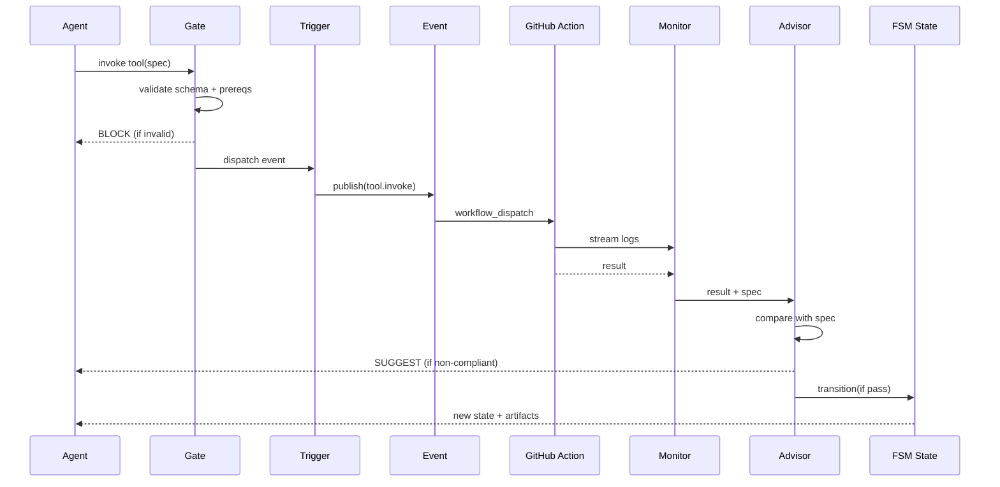

# Hooks — Referência Completa

Os 5 hooks canônicos formam o pipeline obrigatório de qualquer execução
no MCP Builder. Cada hook tem um papel no ciclo PDCA.



## gate (Plan)

Valida pré-condições. Se falha, execução aborta antes de qualquer side effect.

### Built-in gates

| Nome | O que faz | Payload |
|---|---|---|
| `validate_spec` | JSON Schema da MCPSpec | spec: unknown |
| `validate_template` | Verifica template existe | `{sdk, pattern, templatesRoot}` |
| `check_prereqs` | Versões de runtime (Python/Node/Go/Rust) | `{sdks: string[]}` |
| `check_quota` | Limite de projetos por dia | `{projectCount, maxPerDay}` |

### Exemplo: gate customizado

```typescript
import type { HookDescriptor } from '../builder/src/types.js';

export const myGate: HookDescriptor = {
  name: 'check_api_key',
  category: 'gate',
  description: 'Validates that API key is set in env',
  fn: async (ctx) => {
    if (!ctx.env.API_KEY) {
      return {
        ok: false,
        block: {
          reason: 'API_KEY not set',
          suggestions: ['export API_KEY=xxx'],
        },
      };
    }
    return { ok: true };
  },
};
```

## trigger (Do — parte 1)

Dispara eventos após gate passar. Não bloqueia, mas pode falhar se dispatch
falhar (ex: API do GitHub fora do ar).

### Built-in triggers

| Nome | O que faz | Payload |
|---|---|---|
| `dispatch_action` | workflow_dispatch no GitHub | `{workflow, ref, inputs}` |
| `dispatch_local` | Executa comando local (dev) | `{command, args, cwd}` |
| `open_pr` | Cria PR via octokit | `{branch, title, body}` |
| `notify_webhook` | POST para URL externa | `{url, event, data}` |

## event (Do — parte 2: roteamento)

Pub/sub entre eventos e handlers. Não bloqueia.

### API

```typescript
import { eventBus, routeEvent, subscribeEvent, CANONICAL_EVENTS } from '../builder/src/hooks/event.js';

// Subscrever
const unsub = eventBus.subscribe('scaffold.complete', async (payload, ctx) => {
  ctx.logger.info('scaffold completed', payload);
});

// Publicar
await routeEvent(ctx, { event: 'scaffold.complete', payload: { projectPath: '/x' } });

// Dessubscrever
unsub();
```

### Eventos canônicos

`scaffold.requested`, `scaffold.complete`, `scaffold.validated`, `scaffold.failed`,
`tests.requested`, `tests.passed`, `tests.failed`, `e2e.passed`, `e2e.failed`,
`release.complete`, `release.failed`, `advisor.cleared`, `advisor.blocked`,
`manual.archive`.

## monitor (Check)

Coleta métricas e logs durante e após execução. Não bloqueia — apenas observa.

### Built-in monitors

| Nome | O que faz | Payload |
|---|---|---|
| `collect_metrics` | Coleta duração, sucesso/falha | `{name, durationMs, success, extra}` |
| `validate_determinism` | Hash project, compara com esperado | `{expectedHash, projectPath}` |
| `stream_logs` | Envia logs para sink externo | `{level, message, meta}` |
| `notify_stakeholders` | Notifica Slack/email/etc | `{channel, message, mentions}` |

### Exemplo: monitor Prometheus

```typescript
export const prometheusMonitor: HookDescriptor = {
  name: 'prometheus',
  category: 'monitor',
  description: 'Push metrics to Prometheus pushgateway',
  fn: async (_ctx, payload: { metric: string; value: number; labels?: Record<string, string> }) => {
    const labels = payload.labels ? JSON.stringify(payload.labels) : '';
    await fetch(`${process.env.PROM_PUSHGATEWAY}/metrics/job/mcp-builder`, {
      method: 'POST',
      body: `${payload.metric}${labels} ${payload.value}\n`,
    });
    return { ok: true };
  },
};
```

## advisor (Act)

Guardião de qualidade ouro. Pós-execução. Bloqueia se não-conforme.

### Built-in advisors

| Nome | O que faz | Threshold |
|---|---|---|
| `check_coverage` | Cobertura de testes | ≥ 80% |
| `check_mutation` | Mutation score | ≥ 70% |
| `check_compliance` | TODO/FIXME, ADRs, CHANGELOG, LICENSE | 0 issues |
| `check_contracts` | Contract tests passaram | 100% |
| `sign_off` | Combina todas as checks acima | All pass |
| `collect_failure` | Coleta contexto de falha e abre issue | n/a |

### Como o advisor bloqueia

Quando um advisor retorna `{ ok: false, block }`:

1. O `HookRegistry` para a execução do pipeline
2. O workflow `advisor-block.yml` é disparado
3. Uma issue é criada com:
   - Motivo do bloqueio (`block.reason`)
   - Sugestões (`block.suggestions`)
   - Link para o workflow run que falhou
4. O FSM transita para `failed`
5. Só volta para `draft` quando alguém comenta `/advisor-clear` na issue

### Exemplo: advisor customizado

```typescript
export const dependencyVulnsAdvisor: HookDescriptor = {
  name: 'dependency_vulns',
  category: 'advisor',
  description: 'Block release if known vulnerabilities in dependencies',
  fn: async (_ctx, payload: { auditOutput: { vulnerabilities: any[] } }) => {
    const vulns = payload.auditOutput.vulnerabilities;
    if (vulns.length > 0) {
      return {
        ok: false,
        block: {
          reason: `${vulns.length} known vulnerabilities in dependencies`,
          suggestions: vulns.map(v => `upgrade ${v.name} to ${v.fixVersion}`),
          docs: 'https://docs.npmjs.com/auditing-package-dependencies-for-security-vulnerabilities',
        },
      };
    }
    return { ok: true, metrics: { vulnerabilities: 0 } };
  },
};
```

## Composição de hooks

Hooks da mesma categoria rodam em sequência. O primeiro que retorna `block`
interrompe o pipeline.

```typescript
// Ordem de execução do gate
await registry.runCategory('gate', ctx, payload);
// 1. validate_spec
// 2. validate_template
// 3. check_prereqs
// 4. check_quota
// → se qualquer um bloquear, para aqui
```

Para pular hooks em dev:
```bash
mcp-builder new my-mcp --skip-hooks=monitor,advisor
```

## Referência de tipos

```typescript
type Hook<T = unknown> = (ctx: HookContext, payload: T) => Promise<HookResult>;

interface HookContext {
  spec: MCPSpec;
  state: FSMContext;
  artifacts: Artifact[];
  env: Record<string, string>;
  git: { ref: string; sha: string; repo: string };
  logger: Logger;
}

interface HookResult {
  ok: boolean;
  block?: { reason: string; suggestions: string[]; docs?: string };
  metrics?: Record<string, number>;
  artifacts?: Artifact[];
  data?: unknown;
}
```

Veja `builder/src/types.ts` para definições completas.
